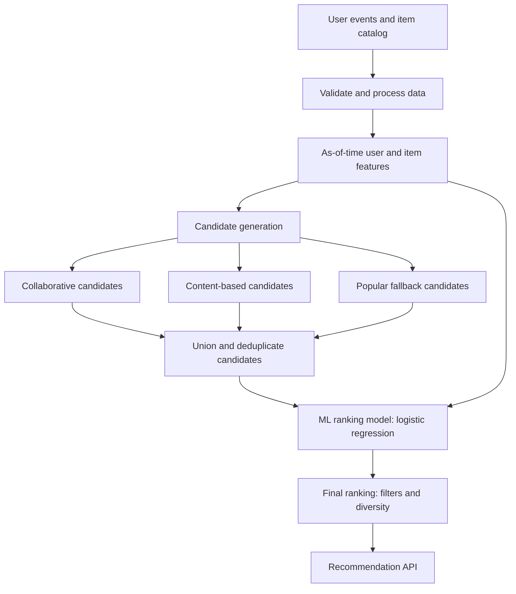

# Recommendation Engine MVP — learning-first project specification

**Purpose:** Build a small recommendation system that you can run, inspect, change, and explain confidently in an interview. This is a local learning project, not a claim of production deployment.

**Working rule:** Create files only when their phase begins. At the start of each phase, read its goal, implement only its listed files, run its checks, record results, and answer its learning questions before moving on. The file map near the end is a roadmap, not a request to scaffold everything now.

## 1. Product definition

The MVP answers: **“Given a visitor and their past interactions, which 10 products should we recommend next?”** It uses a two-stage recommender: collaborative and content-based models **retrieve candidates**, then a separate supervised ML model **ranks** those candidates. A small final-ranking step applies eligibility rules and a diversity limit.

Inputs:

- Product catalog: `item_id`, category, brand, price, and short text for the synthetic catalog.
- Event log: `event_id`, `timestamp`, `visitor_id`, `item_id`, and `event_type` (`view`, `add_to_cart`, or `purchase`); synthetic events may also carry `impression_id`.
- Synthetic impression log: which items were shown at a particular time. This makes the meaning of a negative training example easier to study. The public dataset in Phase 8 may not have impressions.
- API request: visitor ID and desired number of recommendations.

Output: ranked item IDs, scores, and a simple reason/source for each recommendation. Previously purchased items are excluded. Unknown visitors receive a popularity-based fallback.

**Success for learning:** a reproducible demo, two candidate generators, an independently trained ML ranker, fair offline comparisons, and the ability to explain why a specific item was recommended.

**Out of scope:** authentication, cloud deployment, distributed training, live A/B testing, payments, inventory management, and claims of real business impact. No third-party AI API is needed.

## 2. Architecture and data flow



Training is a local batch command. The API loads the candidate generators, feature definitions, and ranker artifacts at startup. A request reads visitor history, retrieves a bounded candidate pool, computes the same features used in training, scores candidates, applies final-ranking rules, and returns results. Re-training is a deliberate command, not part of request handling. This keeps the MVP's component boundaries close to a production recommender while using local files and SQLite.

Use Python, Pandas, NumPy, SciPy sparse matrices, scikit-learn, SQLite, FastAPI, and pytest. SQLite keeps the SQL/data-pipeline aspect visible without infrastructure setup. Keep raw data and trained artifacts out of Git.

### Core interfaces

- `load_events() -> DataFrame` with the canonical event columns above.
- `load_items() -> DataFrame` with `item_id`, `category`, `brand`, `price`, `text` where available.
- Each candidate generator exposes `generate(visitor_id, history, limit) -> list[Candidate]`.
- `Candidate`: `item_id`, generator name, and generator score. Candidate union keeps source flags and scores from all generators.
- A shared `build_rank_features(visitor, candidate, as_of_time)` function creates the exact feature columns used in training and serving.
- The ranker exposes `score(feature_rows) -> ranking_scores`; final ranking filters and orders these rows.
- Evaluation compares retrieval and ranking separately using the same time windows and relevant-item definition.

Do not commit to a complex class hierarchy immediately. These interfaces describe the desired behavior; create abstractions only when a second implementation needs them.

### Why this ML ranker?

The [Google recommendation-system guide](https://developers.google.com/machine-learning/recommendation/overview/types) describes candidate generation, scoring, and final re-ranking as separate stages. It also explains why one scoring model is useful when candidates come from sources whose raw scores are not directly comparable. This MVP follows those boundaries with much smaller data and infrastructure.

| Model | Suitability for this MVP | Decision |
|---|---|---|
| **Regularized logistic regression** | Predicts a binary future-action probability or score, trains quickly, is easy to inspect, and scores a small candidate pool cheaply. It needs careful feature scaling and will miss some nonlinear interactions. [scikit-learn documentation](https://scikit-learn.org/stable/modules/linear_model.html) | **Build first as the main ML ranker.** |
| Ridge regression | Fits a continuous target with squared error. It can be a simple score baseline, but a 0/1 action label makes logistic regression a more natural first choice. [scikit-learn documentation](https://scikit-learn.org/stable/modules/linear_model.html#ridge-regression-and-classification) | Do not use as the main ranker. |
| Histogram gradient boosting classifier | Can model nonlinear feature interactions with a classifier interface, at the cost of more tuning and less transparent scores. [scikit-learn documentation](https://scikit-learn.org/stable/modules/generated/sklearn.ensemble.HistGradientBoostingClassifier.html) | Optional comparison after logistic regression works. |
| LightGBM `LGBMRanker` | Uses a ranking objective and query groups, and is a plausible later production experiment. It adds a dependency and requires careful group construction. [LightGBM documentation](https://lightgbm.readthedocs.io/en/latest/pythonapi/lightgbm.LGBMRanker.html) | Optional advanced phase, not needed for the MVP. |

**MVP target:** for each `(visitor, candidate item, snapshot time)` row, `label = 1` if the visitor adds the item to cart or purchases it in the following 7 days; otherwise `label = 0` as an **offline proxy**. An absent event is not proof of dislike. Synthetic impression logs allow a cleaner subset of negatives from items actually shown; the real dataset may require sampled unobserved negatives, which must be reported as a limitation. The ranker's score is an ordering signal; do not call it a calibrated purchase probability without checking calibration on representative exposure data.

**Initial ranker features, all computed before the snapshot:** collaborative score; content score; popularity score; generator source flags; visitor view/cart/purchase counts; days since last activity; visitor-category affinity; item interaction count; item price or price bucket; and visitor–item price-gap feature. Exclude `visitor_id`, `item_id`, future outcomes, and any aggregate computed past the snapshot cutoff from the model inputs.

**Time-aware training:** make multiple snapshots. At each snapshot, fit candidate generators and feature aggregates on earlier events only; generate candidates; then attach labels from the following 7 days. Use older snapshots for ranker training, a later snapshot for validation and tuning, and the latest snapshot once for testing. Refit the candidate generators as of each snapshot, or freeze them at an earlier cutoff, so a candidate score cannot contain future information. Keep `feature_columns`, preprocessing, and model together in one saved ranker artifact.

## 3. Build phases

### Phase 0 — Generate dummy e-commerce data

**Goal:** Learn what recommendation data looks like and control its behavior before using a messy public dataset.

**Create in this phase:**

```text
README.md                     # current setup and Phase 0 run instructions
pyproject.toml                # minimal dependencies and commands
.gitignore                    # exclude generated data and local artifacts
src/generate_synthetic.py    # deterministic product and event generator
src/explore_data.py          # compact dataset profile
data/synthetic/items.csv     # generated, not hand-written
data/synthetic/events.csv    # generated, not hand-written
data/synthetic/impressions.csv # generated display opportunities
```

Generate about 100 products across 5 categories, 50 visitors, and 8–12 weeks of timestamped activity. Give each visitor 1–2 preferred categories. Draw views more often than carts and purchases; make preferred-category interactions more likely, but include exploration and noise. Include a few new visitors and products with very few interactions. Use a fixed random seed so runs are reproducible. Make prices and short product descriptions believable but simple. Also generate an `impressions.csv` log with `impression_id`, `timestamp`, `visitor_id`, and `item_id` for products shown in a simulated session. Outcomes can reference an impression, but many impressions should have no action.

The generator should produce data that can actually teach a model: some repeated visitor preferences, shared taste between visitors, and enough later events for evaluation. Avoid encoding a perfect recommendation answer or making every visitor behave identically.

**Run and inspect:** generate the CSVs, then print counts by event type/category, events per visitor, item popularity, impression-to-action rate, missing values, and earliest/latest timestamps. Open 5–10 raw rows yourself.

**Checkpoint:** explain what one event row means; why a view is weaker evidence than a purchase; what sparsity and cold start look like in these files. Do not proceed until the data is plausible.

### Phase 1 — Load, clean, and build a popularity baseline

**Status:** Completed: strict validation/deduplication, atomic SQLite import, six time snapshots, and weighted popularity with purchase filtering/cold-start fallback; 41 tests pass.

**Goal:** Turn raw events into a reproducible dataset and produce the first working recommendations.

**Add only:**

```text
src/data.py                  # schema validation, cleaning, SQLite load/read
src/split.py                 # chronological train/validation/test split
src/popularity.py            # popularity scoring and fallback
tests/test_data.py           # meaningful schema/split checks
data/recommendations.db      # generated locally
```

Validate IDs, event types, timestamps, and references to existing items. Remove exact duplicate events and document how invalid rows are handled. Store `items`, `events`, and synthetic `impressions` in SQLite; query a visitor's history and top products with SQL. Assign initial implicit-feedback weights: view = 1, add-to-cart = 3, purchase = 5. Treat these as a hypothesis to revisit.

Split by time, not random rows. Reserve sequential snapshot/outcome windows for ranker training, validation, and final test. Each snapshot uses only earlier events for history and features; the following 7 days supply labels. Put the actual cutoff dates in the README. Derive popularity using events available at the relevant snapshot only. Rank by weighted interaction counts and exclude purchased products.

**Run and inspect:** request 10 items for three visitors and one unknown visitor. Verify no recommendation contains an item that visitor already purchased. Record counts for each snapshot and outcome window.

**Checkpoint:** explain why random splitting can leak future behavior; why popularity is a useful baseline; and what happens to an unknown visitor.


### Phase 2 — Establish evaluation before adding models

**Status:** Completed: reusable evaluation, metric tests, and `reports/baseline.md`; 77 tests pass. Validation (12 visitors): Precision@10 = 0.0167, Recall@10 = 0.1667, MAP@10 = 0.0694, candidate Recall@50 = 0.6528, coverage = 11%. Metrics use recommendable positives; cold start is reported separately. Local latency is recorded; test remains reserved.

**Goal:** Make every later model prove its value against the same baseline.

**Add only:**

```text
src/evaluate.py              # ranking metrics and evaluation loop
tests/test_metrics.py        # hand-calculated metric examples
reports/baseline.md          # generated or manually recorded findings
```

For each eligible visitor, use only history before the snapshot to recommend from the catalog and compare the ranked list with relevant items in the following 7 days. Define relevance before measuring: a held-out add-to-cart or purchase. Exclude visitors with no prior history from the personalized-model comparison; report them separately as a cold-start segment. Keep eligibility rules fixed across models.

Compute `Precision@10`, `Recall@10`, and `MAP@10`. Also report candidate `Recall@50`: what fraction of relevant items entered the candidate pool before ML ranking. The ranker cannot recover a relevant item never retrieved. Report catalog coverage (distinct recommended items / eligible items), the number of evaluated visitors, and median and p95 local latency. Document whether retrieval considers the full catalog or sampled items; prefer the full 100-item synthetic catalog. Tune on validation; reserve test for the final comparison.

**Run and inspect:** manually calculate metrics for one tiny 3-item example and compare with code. Write down the baseline numbers even if they are low.

**Checkpoint:** explain the difference between precision and recall, what MAP rewards, and why an offline metric does not prove business uplift. Do not calculate RMSE unless you later add a clearly defined numeric prediction target; implicit events are not ratings.

### Phase 3 — Collaborative filtering

**Status:** Complete; 99 tests pass. Validation candidate Recall@50: **1.0000**, up from popularity's **0.6528**. Final test remains reserved.

**Goal:** Recommend items based on shared visitor behavior.

**Files:**

```text
src/collaborative.py         # sparse user–item matrix and item similarity
tests/test_collaborative.py  # tiny, interpretable behavior example
```

Uses weighted past events, sparse item cosine similarity, and 20 neighbors per item. Excludes purchases; empty histories use popularity. Saved the bounded model after validation improvement.

**Checkpoint:** Explain cosine similarity, sparsity, and new-item limits; trace one recommendation. See README for measured results, examples, and limitations.

### Phase 4 — Content-based filtering

**Status:** Complete; 128 tests pass. Validation candidate Recall@50: **1.0000**, matching collaborative retrieval. Final test remains reserved.

**Goal:** Recommend items similar to a visitor's demonstrated product interests.

**Files:**

```text
src/content_based.py         # item feature vectors and visitor profile
tests/test_content_based.py  # category/feature behavior example
```

Uses equal-weight category, brand, price-bucket, and TF-IDF vectors with cosine scoring against a visitor profile weighted by views/carts/purchases (1/3/5). Excludes purchases; empty histories use popularity. CLI commands provide recommendations, explanations, and validation comparisons.

Validation Recall@10: **0.388889**; MAP@10: **0.102778**; coverage: **71%**. Retrieved all eight items with no earlier interactions. Median dominant-category share: **90%**, showing narrow recommendations; synthetic text may not transfer to the real dataset.

**Checkpoint:** New-item support, category narrowing, event-weight effects, and a recommendation trace are documented in README with measured results and limitations.

### Phase 5 — Union candidates and build ranker features

**Status:** Complete; 168 tests pass. Implemented the 20/20/10 candidate union, shared cutoff-safe features, and seven-day labels. Seed 42 with 3:1 exposure-first negative sampling produces **196 training rows**; validation retains **1,744 unsampled rows**. Validation candidate Recall@50: **0.847222**, with pools of **28–42 items**. Results, missed positives, and a row trace are in `reports/candidate_analysis.md`. Rebuilds are reproducible; final test remains reserved.

**Goal:** Turn two retrieval sources into a small, well-described set of `(visitor, item)` rows for ML ranking.

**Add only:**

```text
src/candidates.py            # top-N from each source, union, deduplication
src/rank_features.py         # shared as-of-time feature computation
src/rank_dataset.py          # snapshot rows and future-window labels
tests/test_rank_dataset.py   # cutoff, labels, source flags, missing scores
reports/candidate_analysis.md
```

Retrieve up to 20 collaborative and 20 content candidates, plus up to 10 popular fallback candidates. Deduplicate by item ID. Store separate `collab_score`, `content_score`, `popularity_score`, and source flags; use a documented missing-score value and flag when a source did not nominate an item. Keep candidate generation separate from the ML model: the model only scores items that a generator retrieved.

For each ranker-training snapshot, build features from information available **at that snapshot**, then attach the following 7 days' outcome labels. Prefer exposed-but-not-acted-on items for synthetic negatives when exposure records exist; if those do not overlap enough with generated candidates, use sampled no-future-action candidates and document the proxy. Keep a fixed sampling ratio and seed, and never sample negatives from future positives. A product's future popularity or a visitor's future category preference must never enter a feature row.

Measure union candidate `Recall@50`, per-source contribution, overlap, and pool size. If retrieval recall is poor, improve candidate generators before training a more complex ranker.

**Checkpoint:** explain why the ranker cannot rescue missing candidates; show the features and label for one row; identify which timestamp each value comes from.

### Phase 6 — Train the ML ranking model

**Status:** Complete; **205 tests pass**. Implemented training-only imputation/scaling, validation-tuned logistic ranking, five-method same-pool comparisons, and a saved serving bundle with explicit model choice. Selected **C=0.01, no class weighting**. Validation MAP@10: logistic **0.164616**, below the fixed blend's **0.218849**; shared candidate Recall@50: **0.847222**. Results and coefficient/row traces are in `reports/model_comparison.md`. Retraining reproduces rankings; final test remains reserved.

**Goal:** Learn a ranking score from behavior and candidate features.

**Add only:**

```text
src/ranker.py                # preprocessing + logistic regression pipeline
src/train.py                 # reproducible candidate/ranker training command
tests/test_ranker.py         # feature-order, inference, and leakage checks
reports/model_comparison.md  # validation metrics and examples
artifacts/                   # generated model files, excluded from Git
```

Train regularized scikit-learn `LogisticRegression` on older snapshot rows. Impute missing values, scale numeric features, and persist the complete preprocessing-plus-model pipeline with its feature schema. Use `predict_proba(... )[:, 1]` as a ranking score. Tune a small grid of regularization strengths and, if needed, class/sample weights on validation only. Because sampled negatives change class prevalence, treat the output as a score unless probability calibration is checked on representative exposures.

Compare **popularity order**, **collaborative order**, **content order**, a simple hand-weighted blend, and the **ML ranker** on the same validation snapshots and candidate/eligibility rules. Report candidate `Recall@50`, Precision@10, Recall@10, MAP@10, coverage, and scoring latency. Keep the simple blend as a documented alternative if the training set has only one class. The API should use an explicit configured model choice and fail clearly if that model's artifact is missing; it must never silently switch models.

**Checkpoint:** explain the label, at least three feature coefficients, class imbalance, why ridge regression is a weaker first choice for a binary event, and whether the ranker beats the simpler approaches.

### Phase 7 — Final ranking and API

**Goal:** Put the trained two-stage architecture behind a usable backend boundary.

**Add only:**

```text
src/final_ranking.py         # purchased-item filter and simple category cap
src/api.py                   # FastAPI app and request handling
src/schemas.py               # request/response models if useful
tests/test_api.py            # API contract, cold start, and filtering
```

Final ranking removes purchased items and optionally limits one category to a reasonable share of the top 10 so the result is not entirely repetitive. For known visitors, gather candidates, build the shared rank features, score them with the saved ranker, then apply final rules. For unknown visitors, use popular candidates as the documented fallback; the ranker may score them only if its missing-history features were represented in training.

API contract:

```http
GET /health
GET /recommendations/{visitor_id}?k=10
```

Example response:

```json
{
  "visitor_id": "v_001",
  "model_version": "local-001",
  "recommendations": [
    {"item_id": "p_042", "score": 0.82, "sources": ["collaborative", "content"]}
  ]
}
```

Load catalog and model artifacts once at startup. Validate `k` (for example, 1–50), handle unknown visitors, and fail startup clearly if required artifacts are missing. Record p50/p95 local latency for the **whole request**, including retrieval and feature computation. The response score is an ML ordering score, not a guaranteed conversion probability.

**Run and inspect:** call the endpoint for a known and an unknown visitor; trace one item's source scores, ranker features, ranker score, and final position. Compare API output with the direct Python path.

**Checkpoint:** explain offline training versus request-time work, why bounded retrieval helps latency, how final ranking differs from the ML ranker, and which production concerns remain unproven.

### Phase 8 — Replace dummy data with real events

**Goal:** Learn how assumptions change on real, imperfect data.

**Add only:**

```text
src/import_retailrocket.py   # maps source columns to canonical schema
reports/real_data_findings.md
```

Use the [Retailrocket e-commerce dataset](https://www.kaggle.com/retailrocket/ecommerce-dataset/home). First process a manageable, documented subset on your machine. Map `visitorid` to `visitor_id`, `itemid` to `item_id`, and source event names to the canonical event types. Inspect timestamps, duplicates, missing product metadata, activity concentration, and memory use. Re-run the existing pipeline and metrics; do not assume synthetic-data weights will transfer.

Retailrocket's item properties are partly anonymized. For the real-data content model, use defensible available attributes such as category and usable properties. Do not claim real product-description features or search history if they are not in the chosen data. If the real-data content signal is too weak, state that limitation in the report.

Retailrocket does not provide a complete record of which products were displayed but ignored. For this phase, use explicitly labeled **sampled unobserved candidates** as proxy negatives, record the sampling method, and avoid interpreting model output as a true conversion probability. Rebuild time-aware ranker rows; do not transfer a synthetic-data model and claim it learned real-user behavior.

**Checkpoint:** explain which synthetic assumptions broke, how sparsity and negative-label uncertainty changed, candidate recall, and whether the ML ranker improves on popularity and the hand-weighted blend.

### Phase 9 — Optional depth: learning-to-rank or matrix factorization

**Goal:** Explore an advanced method after the full MVP works.

**Add only if time allows:**

```text
src/advanced_ranker.py      # optional LightGBM ranker or boosted classifier
src/factorization.py        # optional collaborative retrieval experiment
reports/advanced_experiments.md
```

Try LightGBM `LGBMRanker` with rows grouped by visitor and snapshot, or a boosted classifier as a nonlinear ranker. Alternatively, try matrix factorization to improve candidate generation. Change one stage at a time and use the same time-based validation and test protocol. Explain the objective, added complexity, latency, and failure modes. If you implement a separate meaningful numeric target, evaluate RMSE for that task; otherwise keep ranking metrics.

This phase is optional. The MVP is complete after Phase 8 if the API works and the real-data comparison report is honest.

## 4. File roadmap

This is the expected shape **after all applicable phases**. Do not create empty files or directories ahead of the phase that needs them.

```text
recommendation-mvp/
├── README.md                         # P0; setup, commands, results summary
├── pyproject.toml                    # P0; dependencies and tool config
├── .gitignore                        # P0; data, DB, artifacts, caches
├── data/
│   ├── synthetic/items.csv           # P0; generated
│   ├── synthetic/events.csv          # P0; generated
│   ├── synthetic/impressions.csv     # P0; generated
│   ├── recommendations.db            # P1; generated
│   └── retailrocket/                 # P8; downloaded source, local only
├── src/
│   ├── generate_synthetic.py         # P0
│   ├── explore_data.py               # P0
│   ├── data.py                       # P1
│   ├── split.py                      # P1
│   ├── popularity.py                 # P1
│   ├── evaluate.py                   # P2
│   ├── collaborative.py              # P3
│   ├── content_based.py              # P4
│   ├── candidates.py                 # P5
│   ├── rank_features.py              # P5
│   ├── rank_dataset.py               # P5
│   ├── ranker.py                     # P6
│   ├── train.py                      # P6
│   ├── final_ranking.py              # P7
│   ├── api.py                        # P7
│   ├── schemas.py                    # P7, if needed
│   ├── import_retailrocket.py        # P8
│   ├── advanced_ranker.py            # P9, optional
│   └── factorization.py              # P9, optional
├── tests/
│   ├── test_data.py                  # P1
│   ├── test_metrics.py               # P2
│   ├── test_collaborative.py         # P3
│   ├── test_content_based.py         # P4
│   ├── test_rank_dataset.py          # P5
│   ├── test_ranker.py                # P6
│   └── test_api.py                   # P7
├── reports/
│   ├── baseline.md                   # P2
│   ├── candidate_analysis.md         # P5
│   ├── model_comparison.md           # P6
│   ├── real_data_findings.md         # P8
│   └── advanced_experiments.md       # P9, optional
└── artifacts/                        # P6; generated, local only
```

`.gitignore` is created in Phase 0 with `data/`, `artifacts/`, SQLite databases, Python caches, and virtual environments excluded. If you later want to share a tiny synthetic example, explicitly include only safe sample CSVs rather than committing an entire data directory by accident.

## 5. Working rhythm for every phase

1. Read the phase goal and predict the expected output before coding.
2. Create only the files named for that phase.
3. Run the smallest command that proves the new behavior works.
4. Inspect real rows, scores, or API responses; do not rely only on a passing test.
5. Record one observation, one limitation, and an answer to each checkpoint question in `README.md` or the phase report.
6. Move forward only when the phase's output is reproducible from its instructions.

Recommended interview narrative: “I began with controlled synthetic behavior, built a popularity baseline, added collaborative and content candidate generators, trained a logistic-regression model to rank their candidates, applied final ranking rules, served the pipeline through an API, then tested it on real e-commerce events.” State measured results from your own report rather than inventing accuracy or latency figures.

## 6. Definition of done

- One command creates reproducible dummy data; one command trains models; one command starts the API.
- Training, validation, and test periods are chronological and documented.
- The comparison report contains real measured numbers for each implemented model and a clear relevance definition.
- Retrieval `Recall@50` and final `Precision@10`, `Recall@10`, and `MAP@10` are reported separately.
- A known visitor and an unknown visitor both receive valid, inspectable recommendations.
- You can trace at least one recommendation through source candidates, as-of-time features, ML score, and final position.
- The README explains setup, file roles, design choices, limitations, and what changed when moving to real data.

## 7. How the MVP maps to a production system

| Architectural boundary | MVP implementation | Production evolution without redesigning the flow |
|---|---|---|
| Event ingestion | CSV files and a repeatable import command | Event stream or warehouse ingestion with quality checks |
| Feature computation | Python functions over SQLite/Pandas | Scheduled feature jobs and an online feature store; shared feature definitions remain essential |
| Candidate generation | Precomputed item similarities plus bounded top-N retrieval | Separate retrieval services, indexed nearest-neighbor search, and regular refreshes |
| ML ranking | Saved logistic-regression pipeline scoring tens of candidates | Independently deployed ranker; later test boosted or learning-to-rank models |
| Final ranking | Purchased-item filter and simple category cap | Inventory, policy, diversity, freshness, and business constraints |
| Serving | One FastAPI process | Replicas, caching, monitoring, versioned artifacts, and rollback |

These are architectural extension points, **not** production capabilities that the MVP has demonstrated. The most important invariant is that training examples and live requests use the same candidate definitions and feature transformations.

**Next action:** begin Phase 6. Train the logistic regression ranker on older snapshot rows, compare ranking approaches on unsampled validation candidates, and keep the final test reserved.
